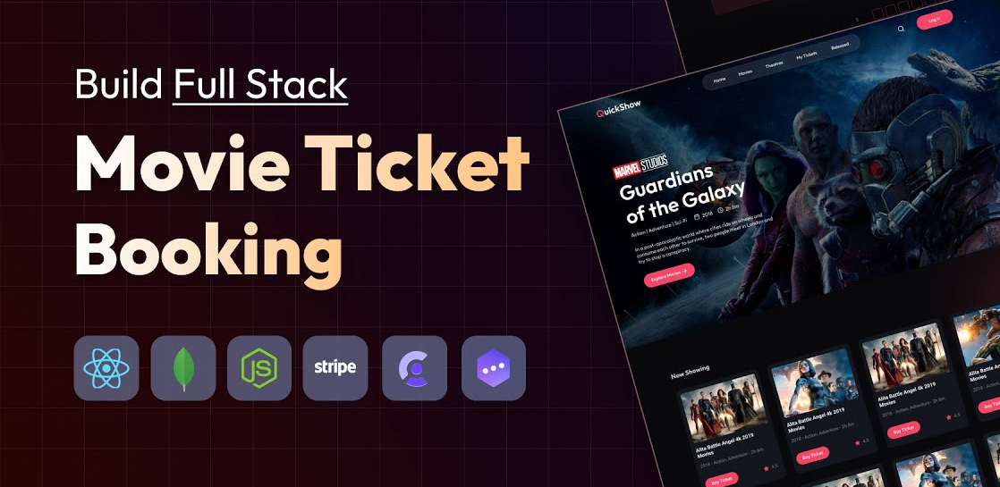

<div align="center">
  <br />
  <a href="https://github.com/Itssanthoshhere/QuickShow-Movie-Theater-Booking-Platform" target="_blank">
    
  </a>
  <br />
  <div>
    
    
    
    
    <br/>
    
    
    
    
  </div>
  <div align="center">
    <h3>🎬 QuickShow – Movie Theater Booking Platform</h3>
    <b>Full-stack movie booking experience</b> built with <b>React, Node.js, and MongoDB</b>. 
    Book tickets in real-time, manage theaters, process payments, and enjoy an admin dashboard that brings the magic of cinema to your fingertips.  
    <br/>
    <i>Designed for movie lovers, admins, and modern theaters seeking a digital booking system.</i>
  </div>
  <br />
  <a href="https://quick-show-ticketbooking.vercel.app/" target="_blank">
    
  </a>
  <br />
</div>

---

## 📋 Table of Contents

1. ✨ [Introduction](#introduction)
2. ⚙️ [Tech Stack](#tech-stack)
3. 🔋 [Features](#features)
4. 🤸 [Quick Start](#quick-start)
5. 🧱 [Project Structure](#project-structure)
6. 🧩 [API Overview](#api-overview)
7. 📝 [Customization](#customization)
8. 🤝 [Contribution](#contribution)
9. 🔗 [Contacts](#contacts)
10. 📄 [License](#license)
11. 🙏 [Acknowledgements](#acknowledgements)

---

## ✨ Introduction

**QuickShow** is a **modern movie theater booking platform** that simplifies ticket management for users and admins alike.  
It features **real-time seat booking**, **secure payments**, and **an intuitive admin dashboard** for theater management.

🎯 Whether you’re running a cinema or booking your next movie night — QuickShow offers a seamless, interactive experience.

---

## ⚙️ Tech Stack

### 💻 Frontend

- **React 19 + Vite** – Fast, modern frontend setup for interactive UIs
- **Tailwind CSS 4** – Clean, responsive design system
- **React Router DOM** – Smooth navigation and route management
- **Axios** – For efficient API communication
- **Lucide React** – Lightweight and elegant icon library

### ⚙️ Backend

- **Node.js + Express 5** – Robust API and server framework
- **MongoDB + Mongoose** – Scalable and schema-based data management
- **Stripe** – Secure online payment processing
- **Clerk** – Authentication and user management with roles
- **Cloudinary** – Media storage for posters and images
- **Nodemailer** – Automated booking email confirmations
- **Inngest** – Background jobs and workflow automation

---

## 🔋 Features

- 🎟️ **Smart Booking System** – Real-time seat availability and interactive seat layouts
- 💳 **Secure Payments** – Integrated with **Stripe** for ticket purchases
- 👥 **User Management** – Login, favorites, and profile powered by **Clerk**
- 🧑‍💼 **Admin Dashboard** – Manage movies, shows, and analytics
- 🎬 **Movie Catalog** – Browse movies with ratings, trailers, and details
- 📧 **Email Notifications** – Instant booking confirmations via **Nodemailer**
- ☁️ **Cloud Storage** – Efficient media management using **Cloudinary**
- 📱 **Responsive UI** – Seamless experience on all devices
- ⚡ **Event Workflows** – Background operations powered by **Inngest**

---

## 🤸 Quick Start

### Prerequisites

Ensure the following are installed:

- [Git](https://git-scm.com/)
- [Node.js](https://nodejs.org/)
- [MongoDB Atlas](https://www.mongodb.com/atlas)
- [Vercel](https://vercel.com/) (for deployment)

### Installation Steps

```bash
# Clone the repository
git clone https://github.com/Itssanthoshhere/QuickShow-Movie-Theater-Booking-Platform.git
cd QuickShow-Movie-Theater-Booking-Platform

# Install dependencies
cd client && npm install
cd ../server && npm install
```

### Environment Variables

Create `.env` files in both `client` and `server` directories:

#### Server (.env)

```env
MONGODB_URI=

CLERK_PUBLISHABLE_KEY=
CLERK_SECRET_KEY=

INNGEST_EVENT_KEY=
INNGEST_SIGNING_KEY=

TMDB_API_KEY=

STRIPE_PUBLISHABLE_KEY=
STRIPE_SECRET_KEY=
STRIPE_WEBHOOK_SECRET=

SENDER_EMAIL=
SMTP_USER=
SMTP_PASS=
```

#### Client (.env)

```env
VITE_CURRENCY='₹'

VITE_CLERK_PUBLISHABLE_KEY=

VITE_BASE_URL=http://localhost:3000

VITE_TMDB_IMAGE_BASE_URL=https://image.tmdb.org/t/p/original
```

### Run the Project

```bash
# Start backend
cd server
npm run dev

# Start frontend
cd client
npm run dev
```

Open 👉 [http://localhost:5173](http://localhost:5173) to explore QuickShow.

---

## 🧱 Project Structure

```
QuickShow/
├── client/
│   ├── src/
│   ├── public/
│   ├── vite.config.js
│   └── vercel.json
└── server/
    ├── configs/
    ├── controllers/
    ├── models/
    ├── routes/
    ├── inngest/
    ├── server.js
    └── vercel.json
```

---

## 🧩 API Overview

| Endpoint                     | Method | Description                   |
| ---------------------------- | ------ | ----------------------------- |
| `/api/show`                  | GET    | Fetch available shows         |
| `/api/booking`               | POST   | Create a new booking          |
| `/api/user/bookings`         | GET    | Get all user bookings         |
| `/api/user/update-favourite` | POST   | Add or remove favorite movies |
| `/api/user/favourites`       | GET    | Fetch user favorite movies    |
| `/api/admin/add-show`        | POST   | Admin: Add a new show         |
| `/api/stripe/webhook`        | POST   | Stripe webhook for payments   |

---

## 📝 Customization

- 🎨 Update branding & colors in `client/src/index.css`
- 🖼️ Replace hero images in `client/public/readme/`
- 🧠 Modify API routes in `server/routes/`
- 💼 Configure environment settings in `.env` files

---

## 🤝 Contribution

Contributions are welcome!

1. Fork this repository
2. Create a new branch (`feature/my-feature`)
3. Commit your changes (`feat: added new feature`)
4. Push to your branch
5. Submit a Pull Request 🎉

---

## 🔗 Contacts

- **GitHub:** [Itssanthoshhere](https://github.com/Itssanthoshhere)
- **LinkedIn:** [Santhosh VS](https://www.linkedin.com/in/thesanthoshvs/)

---

## 📄 License

This project is for **educational and portfolio use only**.
All trademarks, logos, and assets belong to their respective owners.

---

## 🙏 Acknowledgements

- [React](https://react.dev/) – Frontend framework
- [Node.js](https://nodejs.org/) – Backend runtime
- [Tailwind CSS](https://tailwindcss.com/) – Styling framework
- [Vercel](https://vercel.com/) – Hosting platform
- [Stripe](https://stripe.com/) – Payment gateway
- [Clerk](https://clerk.com/) – Authentication
- [Cloudinary](https://cloudinary.com/) – Media storage
- [Inngest](https://inngest.com/) – Background workflows

---

#### ⭐ Show Your Support

If you like **QuickShow**, give it a ⭐ on GitHub and share it with your network!

---
